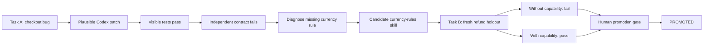
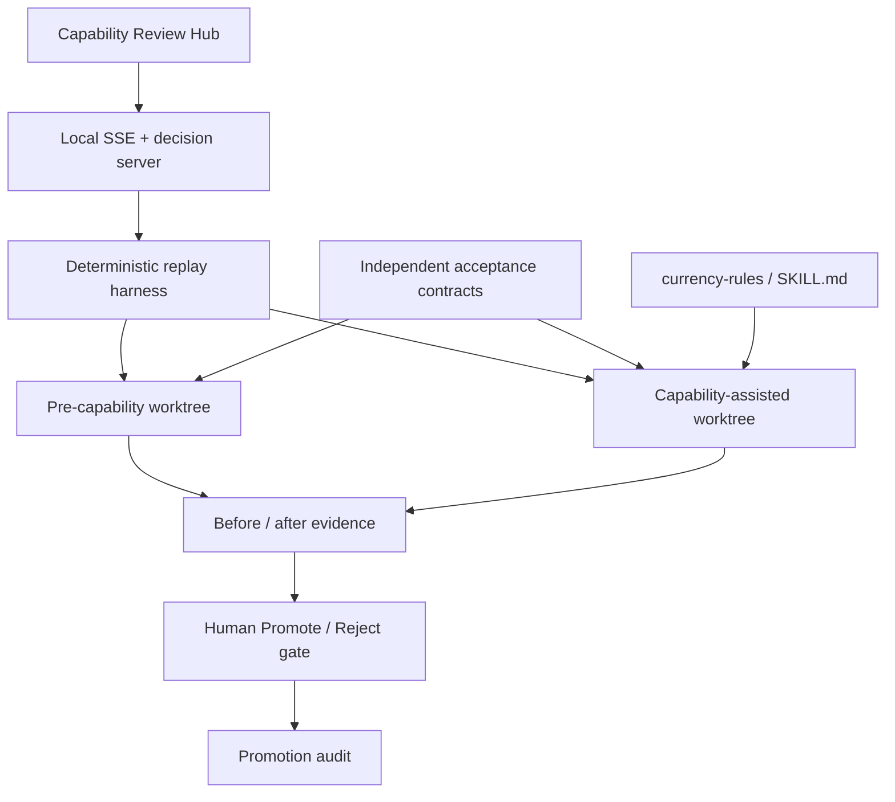

# Prodomi Loop

[](https://github.com/AJ-EN/prodomi-loop/actions/workflows/verify.yml)
[](LICENSE)

> **Coding agents do not fail because they cannot write plausible code. They
> fail because repositories do not preserve and enforce the rules they were
> missing.**

Prodomi Loop turns an observed Codex failure into a small repository capability
and promotes that capability only after it improves a fresh related task under
an independent verifier.

Built for **OpenAI Build Week Community Hackathon - New Delhi NCR, July 2026**.

## The 30-second explanation

Most coding-agent workflows stop when a patch passes tests. That proves one
patch, not that the engineering environment became better.

Prodomi adds a stricter loop:

1. Codex produces a believable Task A patch.
2. Visible tests pass, but an independent acceptance contract catches a hidden
   repository rule.
3. Prodomi diagnoses the missing capability and encodes it as a reviewable repo
   artifact.
4. A fresh Task B runs in clean worktrees both without and with the capability.
5. A human may promote the capability only if Task B improves under the same
   verifier.

The product does not ask, “Did the agent generate code?” It asks, **“Did the
repository earn a reusable improvement?”**

## The first-principles insight

An agentic coding system is not only a model. It is a control loop around a
model:

`task -> context -> action -> independent evaluation -> reusable learning -> fresh task`

Repeated agent failures usually expose one of four missing environmental
capabilities:

| Gap | What the repository lacks | Reusable artifact |
| --- | --- | --- |
| Context | A domain rule or architecture map | Scoped skill or guidance |
| Procedure | A reliable way to reproduce or inspect | Tool or wrapper |
| Specification | A testable definition of “done” | Acceptance contract |
| Verification | Evidence stronger than a plausible diff | Test, log, or holdout |

Generating one of these artifacts is not learning by itself. **It becomes
learning only when it improves a future outcome.** That is why Prodomi has a
promotion gate.

## The demonstrated loop



### Task A: expose the missing rule

The prepared checkout implementation makes a common but incomplete assumption:
all currencies have two decimal places and use round-half-up.

The ordinary visible examples pass. The independent contract checks the cases
that distinguish the repository policy:

| Input | Incorrect candidate | Required result | Why |
| --- | ---: | ---: | --- |
| USD `10.225` | `10.23` | `10.22` | Banker's rounding: round half to even |
| JPY `100.5` | `100.50` | `100` | JPY has zero minor units |

The failure is classified as a **domain-rule / specification gap**, not generic
bad arithmetic.

### Candidate capability

[`skills/currency-rules/SKILL.md`](skills/currency-rules/SKILL.md) makes the
previously hidden policy legible to future Codex runs:

- represent money with `decimal.Decimal`;
- use `ROUND_HALF_EVEN`;
- quantize USD to two minor units;
- quantize JPY to zero minor units;
- reject unknown currencies instead of silently assuming USD precision.

### Task B: prove that the rule transfers

Task B is a related refund calculation, not a rerun of checkout. The same
external verifier evaluates two isolated candidates:

| Candidate | Git base | Holdout result |
| --- | --- | --- |
| Pre-capability baseline | `f0de375` | **FAIL - 0/2** |
| Capability-assisted | `5b4b8e8` | **PASS - 2/2** |

Only after this fresh-task difference does the Review Hub unlock
**Promote capability**.

Preserved evidence:

- [`evidence/task-b-baseline.log`](evidence/task-b-baseline.log)
- [`evidence/task-b-assisted.log`](evidence/task-b-assisted.log)
- [`evidence/task-b-promotion.md`](evidence/task-b-promotion.md)

## Why this is different

| Existing pattern | Where it stops | Prodomi's additional claim |
| --- | --- | --- |
| Patch verification | “This patch passes.” | “This capability improves a fresh related task.” |
| Self-updating prompts | The agent writes new instructions. | Instructions remain candidates until holdout evidence is positive. |
| RAG or repository search | Existing context is retrieved. | Missing context becomes a versioned, test-backed repo capability. |
| Agent swarms | More agents produce or review work. | Implementation and acceptance authority are separated, regardless of agent count. |
| Model fine-tuning | Model weights change. | The repository environment improves; no weight-learning claim is made. |

The novel product unit is therefore not a patch, prompt, retry, or generated
skill. It is an **evidence-backed capability promotion**.

## Why Codex is central

This is not a generic chatbot with Codex added as an API call. The loop depends
on Codex-native engineering primitives:

1. **Repository understanding** - Codex reads the task, source, tests, and
   durable project guidance.
2. **Real code changes** - candidate implementations are reviewable Git diffs.
3. **Worktree isolation** - baseline and assisted candidates run in separate
   clean Git worktrees.
4. **Command execution** - Codex runs visible tests, independent contracts, and
   verification scripts.
5. **Durable guidance** - the learned currency policy becomes a repo-local
   `SKILL.md`, not chat history.
6. **Fresh-task reuse** - Task B demonstrates that the operating environment
   guides the next coding task more reliably.

Codex was also used to build the harness itself: task contracts, candidate
branches, capability artifact, replay tooling, Review Hub, CI verification, and
demo hardening were developed through repository-native Codex workflows.

## Trust model

Prodomi avoids “the model graded its own homework” by separating roles:

| Role | May see | Cannot decide |
| --- | --- | --- |
| Implementer | Task, source, normal guidance, visible tests | Whether its own patch is accepted |
| Verifier | Candidate source and independent contract | How the patch should be implemented |
| Diagnoser | Failure evidence and repository surface | Whether a patch passed without test evidence |
| Human reviewer | Capability diff and holdout evidence | Anything hidden from the audit trail |

The acceptance contracts live outside the candidate source path. Promotion is
disabled until the baseline-versus-assisted Task B comparison is complete.

## Live Review Hub

### Hosted judge preview

The Vercel deployment provides an interactive replay of evidence already
verified by GitHub Actions. It is explicitly labeled as a **hosted verified
replay**; it does not pretend that Vercel executed local Git worktrees.

### Real local proof

Run the no-dependency local application:

```sh
python3 review-hub/server.py
```

Open `http://127.0.0.1:8000` and click **Run live proof**. The server:

1. creates two temporary Git worktrees;
2. streams the real verifier events into the browser;
3. removes the temporary worktrees;
4. unlocks Promote/Reject only when the holdout evidence matches;
5. records the human decision in `.prodomi/demo-decision.json`.

## Reproduce the evidence

Run the independent contracts on `main`:

```sh
python3 -m unittest discover -s acceptance -p 'test_*.py'
```

Replay the complete before/after experiment:

```sh
python3 scripts/replay_loop.py
```

Exercise the browser server, event stream, gate, and decision endpoint:

```sh
python3 scripts/smoke_review_hub.py
```

Run the three-rehearsal reliability gate:

```sh
python3 scripts/rehearse.py --runs 3 --max-seconds 90
```

The measured local rehearsals completed in `0.42s`, `0.31s`, and `0.31s`.
GitHub Actions independently reruns the tests, worktree replay, and Review Hub
smoke test on every push or pull request to `main`.

## Architecture



No external API or paid service sits on the critical demo path. The proof is
fast, local, deterministic, and has a CLI fallback.

## Repository map

```text
acceptance/                 Independent Task A and Task B contracts
docs/                       Public demo and reproducibility documentation
evidence/                   Preserved baseline, assisted, and promotion logs
review-hub/                 Minimal live UI and local evidence server
scripts/replay_loop.py      Clean-worktree before/after experiment
scripts/rehearse.py         Three-run reliability gate
scripts/smoke_review_hub.py Server and interaction smoke test
skills/currency-rules/      Promoted repository capability
src/                        Checkout and refund implementations
tasks/                      Task A incident and Task B holdout definitions
tests/                      Tests visible to the implementation candidate
```

## How the project addresses the judging criteria

| Criterion | Evidence in Prodomi Loop |
| --- | --- |
| Usefulness | Reduces repeated context discovery and review work when coding agents encounter repository-specific rules. |
| Creativity | Treats a validated repository capability—not a patch—as the compounding unit of value. |
| Problem-solving | Converts a false acceptance into a reusable rule and proves transfer on a fresh task. |
| Technical execution | Real Git worktrees, immutable evidence commits, independent tests, SSE streaming, decision audit, and CI replay. |
| Demo quality | One visible sequence: green → caught red → encoded rule → holdout red/green → Promote. |
| Effective Codex use | Repository understanding, code edits, commands, tests, worktrees, diffs, durable skills, and fresh-task reuse are all on the critical path. |

## What Prodomi does not claim

- It does not modify or fine-tune model weights.
- It does not prove production security or sandbox isolation.
- It does not autonomously merge or deploy code.
- It does not generalize from one controlled MVP to every repository.
- It does not treat a generated skill as proven learning.

Production hardening would add policy enforcement, signed audit logs, broader
holdout suites, CI/issue-tracker integrations, and stronger isolation. The
hackathon MVP deliberately proves the smallest complete loop first.

## Open-source direction

Prodomi Loop is released under the [Apache License 2.0](LICENSE). The project is
open for inspection, reproduction, modification, and commercial use under the
license terms. The Prodomi name and identity are not licensed as trademarks.

The next milestone is cross-domain evidence, not more interface surface. See
the [roadmap](ROADMAP.md) for the validation plan and
[contribution guide](CONTRIBUTING.md) before proposing changes.

If you reproduce the experiment, open an issue with the repository, task,
independent verifier, baseline result, assisted result, and capability diff.
Both successful and rejected promotions are useful evidence.

## Pitch

> Coding agents repeatedly fail because repositories do not preserve the rules
> they discover. Prodomi turns one failure into a reusable capability, proves
> that capability improves a fresh task under an independent verifier, and lets
> a human promote it for future Codex runs. We do not measure code output. We
> measure whether the repository environment got better.

For the exact 90-second narration and terminal fallback, see
[`docs/demo-runbook.md`](docs/demo-runbook.md).

Copyright 2026 Ayush Jangid. Licensed under Apache-2.0.
